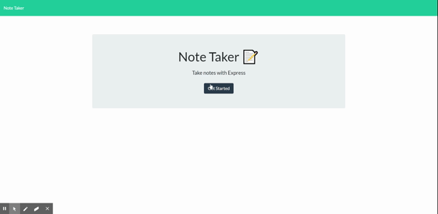

# HW11_Note-Taker

## **Description**

The main concept of this homework assignment was to use express.js to create the backend of a note-taking app and connect it to a pre-made frontend. The note data is stored as a JSON file. I was able to utilize the GET, POST, and DELETE methods of express to get the app fully functional.

## **Link**

The app is deployed on heroku [here](https://desolate-inlet-65279.herokuapp.com/).

## **License**

This project uses the MIT license.

## **Questions**

If you have any questions or comments about this repository, please contact me at peter.phenow@gmail.com.

Please visit [peterphenow](https://github.com/peterphenow) to view more of my work.
